```mermaid
graph TB
    subgraph "DOMINION OS ECOSYSTEM - Google Cloud Platform"
        subgraph "Development & Staging Environment"
            DEV["dominion-os-1-0-main<br/>Project #829831815576<br/><b>9 SERVICES</b>"]

            subgraph "DEV Gateways - Testing & Validation"
                DEV_AG["dominion-ai-gateway<br/>🧪 AI Gateway Testing"]
                DEV_F5["dominion-f5-gateway<br/>🧪 F5 Integration Testing"]
            end

            subgraph "DEV User Interfaces - QA & Iteration"
                DEV_UI["dominion-phi-ui<br/>🔄 PHI UI Development"]
                DEV_CHAT["askphi-chatbot<br/>🔄 Chatbot Testing"]
            end

            subgraph "DEV APIs - New Features"
                DEV_API1["dominion-os-api<br/>🆕 API Development"]
                DEV_RT["dominion-os-1-0<br/>⚙️ Runtime Testing"]
            end

            subgraph "DEV Operations - Monitoring Tools"
                DEV_MON["dominion-monitoring-dashboard<br/>📊 Observability"]
                DEV_REV["dominion-revenue-automation<br/>💰 Revenue Ops Dev"]
                DEV_SEC["dominion-security-framework<br/>🚧 Security (Placeholder)"]
            end

            DEV --> DEV_AG
            DEV --> DEV_F5
            DEV --> DEV_UI
            DEV --> DEV_CHAT
            DEV --> DEV_API1
            DEV --> DEV_RT
            DEV --> DEV_MON
            DEV --> DEV_REV
            DEV --> DEV_SEC
        end

        subgraph "Production Environment - Customer Facing"
            PROD["dominion-core-prod<br/>Project #447370233441<br/><b>13 SERVICES</b>"]

            subgraph "PROD Gateways - 99.9% SLO"
                PROD_GW["dominion-gateway<br/>🔴 Production Gateway"]
                PROD_AG["dominion-ai-gateway<br/>🔴 AI Gateway PROD"]
                PROD_F5["dominion-f5-gateway<br/>🔴 F5 Gateway PROD"]
            end

            subgraph "PROD APIs - High Availability"
                PROD_API1["dominion-api<br/>🔴 Core API"]
                PROD_API2["api<br/>🔴 Generic API"]
            end

            subgraph "PROD Runtimes - Redundancy (3x)"
                PROD_RT1["dominion-os<br/>🔴 Runtime Instance 1"]
                PROD_RT2["dominion-os<br/>🔴 Runtime Instance 2"]
                PROD_RT3["dominion-os<br/>🔴 Runtime Instance 3"]
            end

            subgraph "PROD Orchestration"
                PROD_ORCH["dominion-os-1-0-101<br/>🔴 OS Orchestration"]
                PROD_UI["dominion-phi-ui<br/>🔴 PHI UI Production"]
                PROD_COS["dominion-chief-of-staff<br/>🚧 Ops Mgmt (Placeholder)"]
            end

            subgraph "PROD Demo Services - 95% SLO"
                PROD_DEMO1["demo<br/>🎭 Demo Environment"]
                PROD_DEMO2["dominion-demo<br/>🎭 Dominion Demo"]
                PROD_DEMO3["dominion-os-demo<br/>🎭 OS Demo"]
            end

            subgraph "PROD Utilities"
                PROD_PIPE["pipeline<br/>🔧 Pipeline Service"]
            end

            PROD --> PROD_GW
            PROD --> PROD_AG
            PROD --> PROD_F5
            PROD --> PROD_API1
            PROD --> PROD_API2
            PROD --> PROD_RT1
            PROD --> PROD_RT2
            PROD --> PROD_RT3
            PROD --> PROD_ORCH
            PROD --> PROD_UI
            PROD --> PROD_COS
            PROD --> PROD_DEMO1
            PROD --> PROD_DEMO2
            PROD --> PROD_DEMO3
            PROD --> PROD_PIPE
        end

        subgraph "Service Promotion Pipeline"
            COMMIT["Developer Commit"]
            CI["CI/CD Build & Test"]
            DEPLOY_DEV["Deploy to DEV<br/>dominion-os-1-0-main"]
            QA["QA & Validation"]
            APPROVE["Approval Gate<br/>Matthew Burbidge"]
            DEPLOY_PROD["Deploy to PROD<br/>dominion-core-prod"]
            MONITOR["Monitor SLOs<br/>99.9% Target"]

            COMMIT --> CI
            CI --> DEPLOY_DEV
            DEPLOY_DEV --> QA
            QA --> APPROVE
            APPROVE --> DEPLOY_PROD
            DEPLOY_PROD --> MONITOR
        end

        DEV -.-> |"Validated Services<br/>Promoted To"| PROD
    end

    subgraph "Additional Dominion Projects - Investigation Required"
        OTHER["dominion-api-prod<br/>dominion-apps-prod<br/>dominion-endpoints-prod<br/>dominion-engines-prod<br/>dominion-github-apps-prod<br/>dominion-labs-prod<br/>dominion-marketplace-prod<br/>dominion-os (legacy?)<br/><br/>📊 8+ Projects<br/>🔍 Status Unknown"]
    end

    PROD -.-> |"May Have Dependencies"| OTHER

    style DEV fill:#fff4cc,stroke:#ffbb00,stroke-width:3px
    style PROD fill:#ffcccc,stroke:#ff0000,stroke-width:3px
    style OTHER fill:#e6e6e6,stroke:#666666,stroke-width:2px,stroke-dasharray: 5 5

    style DEV_AG fill:#e6f3ff,stroke:#0066cc
    style DEV_F5 fill:#e6f3ff,stroke:#0066cc
    style DEV_UI fill:#f0e6ff,stroke:#7700cc
    style DEV_CHAT fill:#f0e6ff,stroke:#7700cc
    style DEV_API1 fill:#e6ffe6,stroke:#00cc00
    style DEV_RT fill:#e6ffe6,stroke:#00cc00
    style DEV_MON fill:#ffe6f0,stroke:#cc0066
    style DEV_REV fill:#ffe6f0,stroke:#cc0066
    style DEV_SEC fill:#f5f5f5,stroke:#999999,stroke-dasharray: 3 3

    style PROD_GW fill:#ffb3b3,stroke:#cc0000
    style PROD_AG fill:#ffb3b3,stroke:#cc0000
    style PROD_F5 fill:#ffb3b3,stroke:#cc0000
    style PROD_API1 fill:#ffccb3,stroke:#ff6600
    style PROD_API2 fill:#ffccb3,stroke:#ff6600
    style PROD_RT1 fill:#ffccb3,stroke:#ff6600
    style PROD_RT2 fill:#ffccb3,stroke:#ff6600
    style PROD_RT3 fill:#ffccb3,stroke:#ff6600
    style PROD_ORCH fill:#ffd9b3,stroke:#ff9933
    style PROD_UI fill:#ffd9b3,stroke:#ff9933
    style PROD_COS fill:#f5f5f5,stroke:#999999,stroke-dasharray: 3 3
    style PROD_DEMO1 fill:#e6ccff,stroke:#9933ff
    style PROD_DEMO2 fill:#e6ccff,stroke:#9933ff
    style PROD_DEMO3 fill:#e6ccff,stroke:#9933ff
    style PROD_PIPE fill:#cce6ff,stroke:#3399ff
```

## Legend

### Environment Colors
- 🟡 **Yellow Background**: Development/Staging Environment (dominion-os-1-0-main)
- 🔴 **Red Background**: Production Environment (dominion-core-prod)
- ⚪ **Gray Background**: Unknown/Unmonitored Projects

### Service Status Indicators
- 🧪 **Testing** - Active development and QA
- 🔄 **Iteration** - Rapid feature development
- 🆕 **New** - Recently deployed (< 1 week)
- ⚙️ **Runtime** - Core execution environment
- 📊 **Observability** - Monitoring and analytics
- 💰 **Business** - Revenue and operations
- 🚧 **Placeholder** - Defined but not active
- 🔴 **Production** - Customer-facing, 99.9% SLO
- 🎭 **Demo** - Public demonstration, 95% SLO
- 🔧 **Utility** - Supporting infrastructure

### Service Types by Color
- 🔵 **Blue** - Gateways (AI, F5)
- 🟣 **Purple** - User Interfaces (PHI UI, Chatbot)
- 🟢 **Green** - APIs & Runtimes
- 🔴 **Red/Pink** - Operations & Monitoring
- 🟠 **Orange** - Demo Services
- 🔷 **Light Blue** - Utilities

---

## Statistics

| Metric | Development | Production | Total |
|--------|-------------|------------|-------|
| **Total Services** | 9 | 13 | 22 |
| **Gateways** | 2 | 3 | 5 |
| **APIs** | 2 | 2 | 4 |
| **UIs** | 2 | 1 | 3 |
| **Runtimes** | 1 | 3 | 4 |
| **Operations** | 3 | 1 | 4 |
| **Demos** | 0 | 3 | 3 |
| **Utilities** | 0 | 1 | 1 |
| **SLO Target** | 95%+ | 99.9% | Varies |
| **Monthly Cost** | $50-100 | $300-400 | $350-500 |

---

## Key Architectural Principles

1. **Separation of Concerns**: Development experiments cannot impact production customers
2. **Progressive Promotion**: Services validated in DEV before PROD deployment
3. **Redundancy in Production**: 3x runtime instances for high availability
4. **Cost Optimization**: DEV scales to zero, PROD maintains availability
5. **Security Isolation**: Different IAM policies and access controls per environment
6. **Compliance Ready**: Clear audit trail for SOC2, HIPAA, GDPR attestation

---

*Generated by PHI Chief Sovereign Autopilot*
*Architecture Analysis Date: March 1, 2026*
